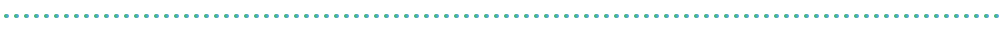

<p align="center">
  
</p>

<div align="center">


<a href="https://www.linkedin.com/in/aayush-ranjan-dev/"></a>
<a href="mailto:Aayushranjan26092006@gmail.com"></a>
<a href="https://github.com/Aayush-Ranjan-26"></a>


</div>



### `>` INITIATING BOOT SEQUENCE




<table>
<tr>
<td width="34%" align="center">



</td>
<td width="66%" valign="top">

### `$ whoami`

```yaml
name:        Aayush Ranjan
handle:      "@Aayush-Ranjan-26"
role:        B.Tech — AI & Machine Learning (3rd year)
college:     SRM, Ghaziabad NCR  ·  CGPA 8.2
experience:  Software/IT Automation Intern, STPI-HQ
focus:       Applied ML | Local AI | Automation
domains:     NLP · Computer Vision · Predictive Modeling
open_to:     ML | Data Science | AI Engineering internships
```

```
$ cat ./mission.log
# ─────────────────────────────────────────────
> I design and evaluate end-to-end ML pipelines,
  then put them behind real interfaces.
> Local-first AI with Ollama; agentic automation
  with n8n and MCP.
> Grounded in statistical learning, Python-based
  development and system design.
> Research is only finished when it deploys.
# ─────────────────────────────────────────────
$ _
```

</td>
</tr>
</table>


### `>` INSTALLING TECH STACK



<div align="center">

</div>

<table>
<tr><th width="26%" align="left">Layer</th><th align="left">Tools</th></tr>
<tr>
<td><b>Languages</b></td>
<td>


</td>
</tr>
<tr>
<td><b>ML / Data</b></td>
<td>


</td>
</tr>
<tr>
<td><b>Local AI / Automation</b></td>
<td>


</td>
</tr>
<tr>
<td><b>Web</b></td>
<td>


</td>
</tr>
<tr>
<td><b>Tools / Deploy</b></td>
<td>


</td>
</tr>
</table>


### `$ ls ~/projects --detail`



<table>
<tr>
<td width="50%" valign="top">

#### 🔍 CryptoSleuth &nbsp;

Real-time identification of fraud-linked crypto exchanges from victim-reported
wallet addresses. **I own the blockchain analysis & transaction tracing engine.**

`Python` `blockchain` `graph analysis`

</td>
<td width="50%" valign="top">

#### 🎬 [TubeTome](https://github.com/Aayush-Ranjan-26/TubeTome)

Full-stack automation bridge that imports YouTube playlists into NotebookLM.

`React` `Express` `Playwright` `Supabase` `YouTube API`

</td>
</tr>
<tr>
<td valign="top">

#### 🏠 [Boston House Price Prediction](https://github.com/Aayush-Ranjan-26/Boston-House-Price-Prediction)

Regression model with scikit-learn pipelines, feature scaling via `scaler.pkl`,
and model persistence for real-time inference through `run.py`.

`scikit-learn` `regression` `MLOps`

</td>
<td valign="top">

#### 💰 Finance Tracker

Full-stack personal finance app — RESTful backend APIs, interactive UI and an
automated test suite with structured reports.

`full-stack` `REST` `testing`

</td>
</tr>
<tr>
<td valign="top">

#### 🛡️ PulseGuard

Automated infrastructure health sentinel and incident response pipeline.

`monitoring` `automation`

</td>
<td valign="top">

#### 📄 DocuFlow AI &nbsp;·&nbsp; 🌱 [GreenPulse](https://github.com/Aayush-Ranjan-26/greenpulse)

Local document summarizer & organizer, plus a responsive sustainability web app
built during a hackathon.

`local AI` `web`

</td>
</tr>
</table>

<div align="center">
<a href="https://github.com/Aayush-Ranjan-26?tab=repositories"></a>
</div>


### `$ cat ./credentials.log`



<table>
<tr><th width="22%" align="left">When</th><th align="left">What</th><th width="26%" align="left">Where</th></tr>
<tr><td><b>2024 — 2028</b></td><td><b>B.Tech — Artificial Intelligence & Machine Learning</b> · CGPA 8.2</td><td>SRM, Ghaziabad NCR</td></tr>
<tr><td><b>2024</b></td><td>Higher Secondary — Science (PCM), First Division</td><td>Kendriya Vidyalaya, INA</td></tr>
<tr><td>Feb 2026</td><td>SnowStoorm Hackathon</td><td>—</td></tr>
<tr><td>Oct 2025</td><td>Oracle Certified Foundations Associate</td><td>Oracle</td></tr>
<tr><td>Aug 2025</td><td>Python (Basic)</td><td>HackerRank</td></tr>
<tr><td>Jun 2025</td><td>Solutions Architecture Job Simulation</td><td>Forage</td></tr>
<tr><td>Jan 2025</td><td>Python: Zero to Hero Bootcamp</td><td>Devtown</td></tr>
</table>


<div align="center">

### `>` GITHUB TELEMETRY


</div>

<p align="center">
  
</p>


### `$ ./connect.sh`

```
aayush@dev:~$ ./connect.sh --establish-uplink

  [ github   ]  https://github.com/Aayush-Ranjan-26
  [ linkedin ]  https://www.linkedin.com/in/aayush-ranjan-dev
  [ email    ]  Aayushranjan26092006@gmail.com
  [ location ]  Ghaziabad, India
  [ open-to  ]  ML · Data Science · AI Engineering internships

  > channel open. say hi anytime.
aayush@dev:~$ _
```


<p align="center"><code>// thanks for dropping into my terminal — may your builds be green and your bugs be few //</code></p>
