  

  Building practical Machine Learning, local AI workflows, and automation systems.

## Selected Projects

| Project | What it demonstrates |
| --- | --- |
| [Telco Customer Churn ML Pipeline](https://github.com/Aayush-Ranjan-26/Future_interns-ML_project_2) | Reproducible churn-modeling pipeline with preprocessing, SMOTE, model selection, evaluation outputs, and saved model artifacts. |
| [Customer Support Chatbot](https://github.com/Aayush-Ranjan-26/Future_interns-ML_project_3) | Python chatbot with intent matching, conversation history, Streamlit interface, and optional Telegram integration. |
| [Boston House Price Prediction](https://github.com/Aayush-Ranjan-26/Boston-House-Price-Prediction) | Scikit-learn regression workflow with feature scaling, model serialization, and inference. |
| [TubeTome](https://github.com/Aayush-Ranjan-26/TubeTome) | Full-stack automation bridge that imports YouTube playlists into NotebookLM using React, Express, Playwright, Supabase, and the YouTube Data API. |
| [GreenPulse](https://github.com/Aayush-Ranjan-26/greenpulse) | Responsive sustainability-focused web application built during a hackathon. |

## Currently Building

- Explainable Machine Learning and predictive-modeling workflows
- Local LLM automation with Ollama, n8n, and SQLite
- MCP tools that connect AI agents with desktop applications

## Technical Focus

`Python` · `scikit-learn` · `Pandas` · `NumPy` · `Ollama` · `n8n` · `MCP` · `SQLite` · `Git` · `Docker`

## Connect

[LinkedIn](https://www.linkedin.com/in/aayush-ranjan-dev/)
