<div align="center">

# Hey, I'm Aayush 👋

[](https://www.linkedin.com/in/aayush-ranjan-dev/)
[](https://x.com/Aayush_Ranjan_1)


</div>

<p align="center">
  
</p>

<p align="center">
  Building practical Machine Learning, local AI workflows, and automation systems.
</p>

<br>

### `$ cat about.md`

```text
Third-year B.Tech AI/ML student @ SRMIST, based in Ghaziabad, India.
Previously automated software/IT workflows as an intern @ STPI-HQ.

These days I spend most of my time on:
  → practical, explainable ML pipelines
  → local-first AI, powered by Ollama
  → agentic automation with n8n + MCP

I like tools that actually ship — not just notebooks that impress.
```

<br>

### `$ pip install tech-stack`

<p align="center">
  
  
  
  
  
  <br>
  
  
  
  
  
</p>

<br>

### `$ cat currently_building.log`

- 🔍 **CryptoSleuth** (SIH26183) — real-time tracing of fraud-linked crypto exchanges for Smart India Hackathon 2026; building the blockchain tracing engine module
- 🧠 Explainable ML and predictive-modeling workflows
- 🖥️ Local LLM automation with Ollama, n8n, and SQLite
- 🔌 MCP tools that connect AI agents to desktop applications

<br>

### `$ ls ~/projects --recent`

| Project | What it demonstrates |
|---|---|
| [TubeTome](https://github.com/Aayush-Ranjan-26/TubeTome) | Full-stack automation bridge that imports YouTube playlists into NotebookLM using React, Express, Playwright, Supabase, and the YouTube Data API. |
| PulseGuard | Automated Infrastructure Health Sentinel & Incident Response Pipeline |
| DocuFlow AI | Automated Local Document Summarizer & Organizer |
| [GreenPulse](https://github.com/Aayush-Ranjan-26/greenpulse) | Responsive sustainability-focused web application built during a hackathon. |

<br>

### `$ ./connect.sh`

```bash
$ ./connect.sh --establish-uplink

  [ github   ]  https://github.com/Aayush-Ranjan-26
  [ linkedin ]  https://www.linkedin.com/in/aayush-ranjan-dev
  [ x        ]  https://x.com/Aayush_Ranjan_1
  [ location ]  Ghaziabad, India

  > channel open. say hi anytime.
$ _
```

<br>

<div align="center">

### 📊 GitHub Stats


</div>

<br>

### Contribution Activity

<p align="center">
  
</p>

<br>

<p align="center"><i>// thanks for reading this far — my terminal's always open, drop a message anytime //</i></p>
